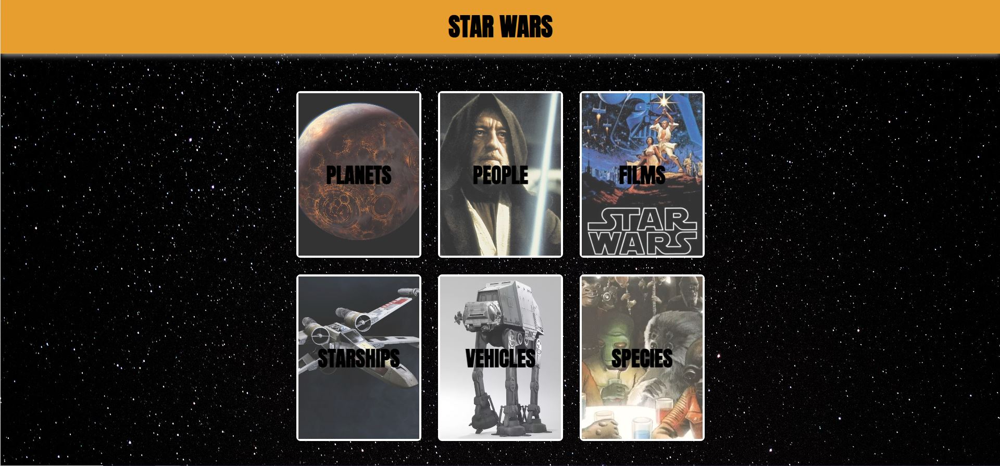
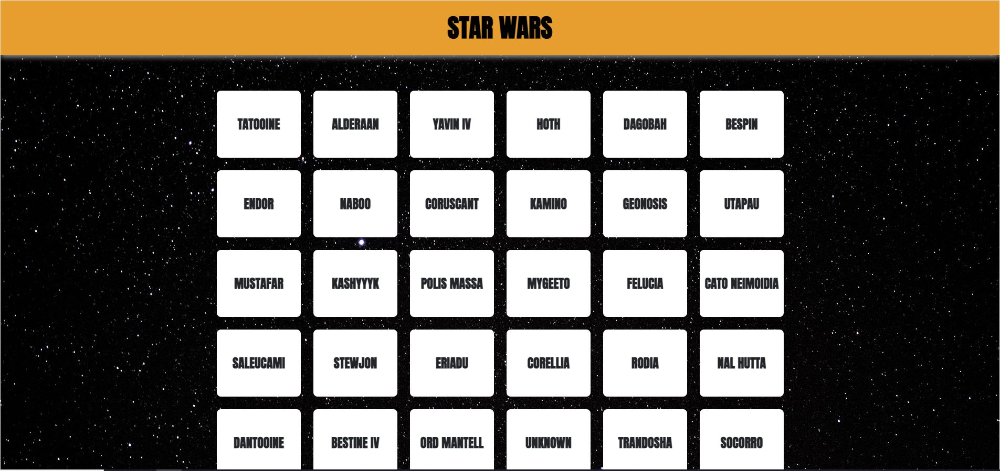
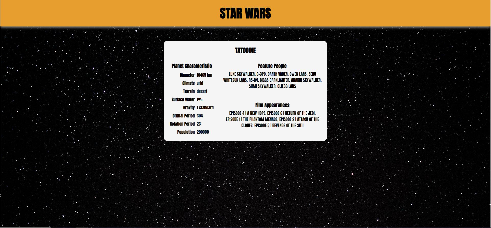

# StarWars

Created by:
<a class="link-formatter" href="https://github.com/madebymiguel" target="_blank"
              >Miguel</a
            >


**HomePage**


**Planet Grid View Page**


**Planet Info Page**

## Setup

To set up the server locally, run the following:

```shell
npm i && npm start
```

## Built With

- [SWAPI](https://swapi.dev/)
- React
- TypeScript
- SASS
- React Router Dom
- [React Parallax Tilt](https://www.npmjs.com/package/react-parallax-tilt)

## Features include:

- Being able to search by type of data such as Planets, People, Films, etc
- You start out on the HomePage where you can click on the category you want to learn more about
- After you are taking to a grid view of all available data on that category
- Click on a grid item takes you to the final page where there is an info card on the available info on the item you click on
- From there certain data are links to learn more about that certain topic
- Grids are saved in session storage for faster reloads to grid view
